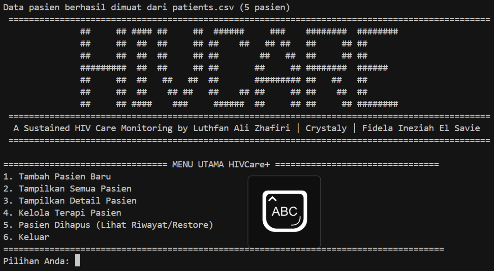
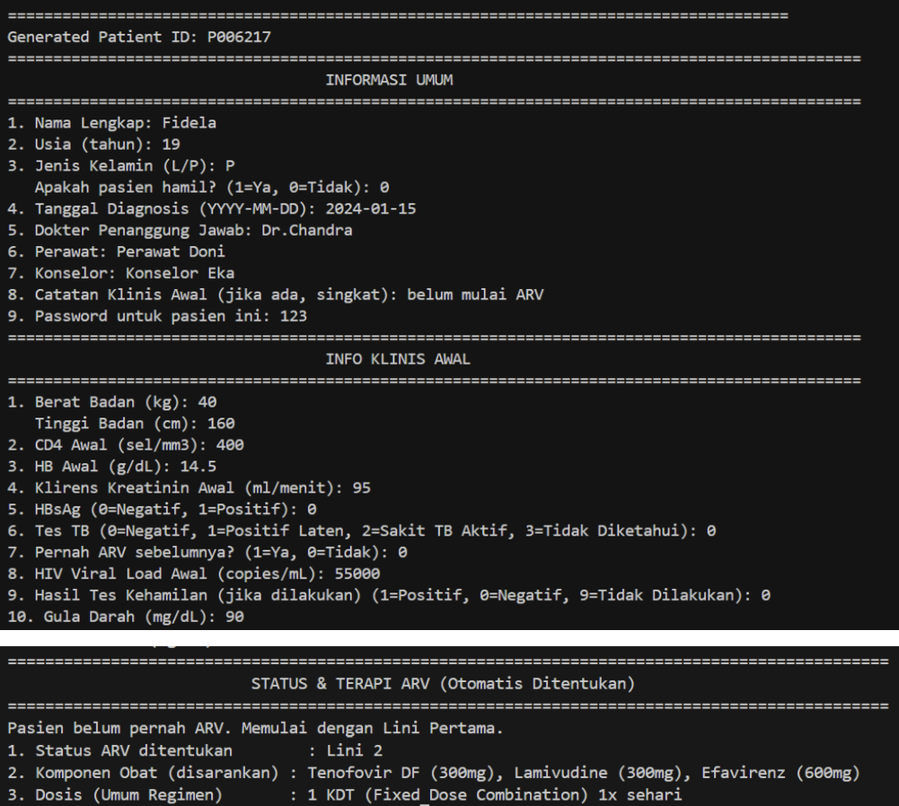
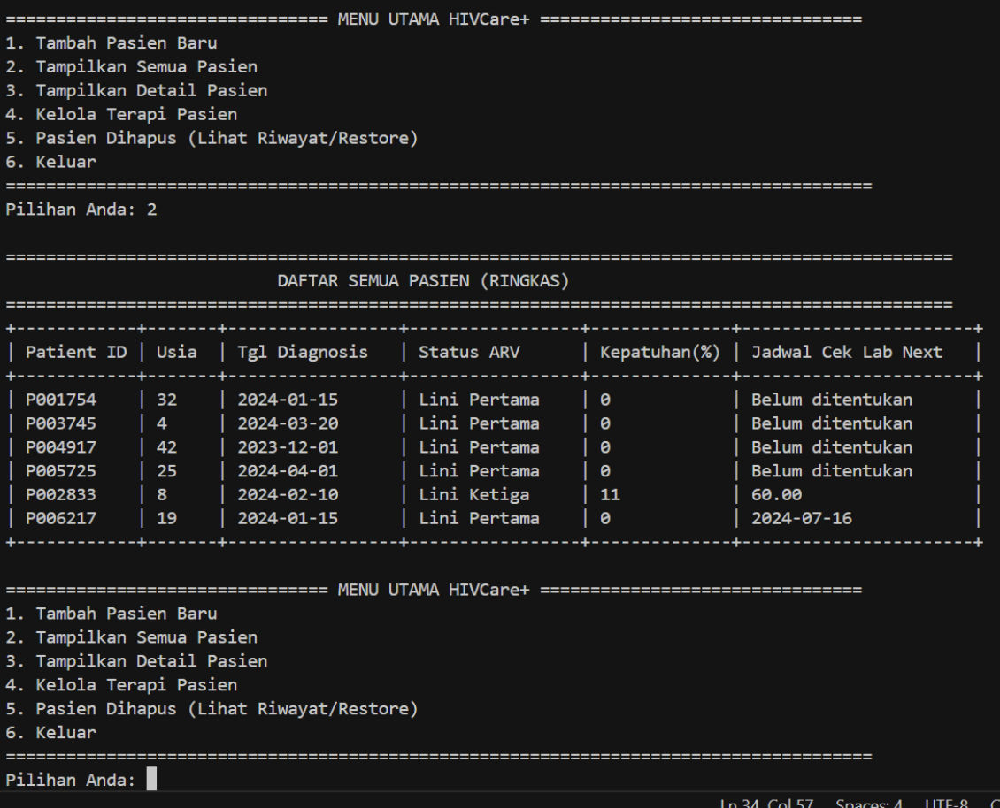
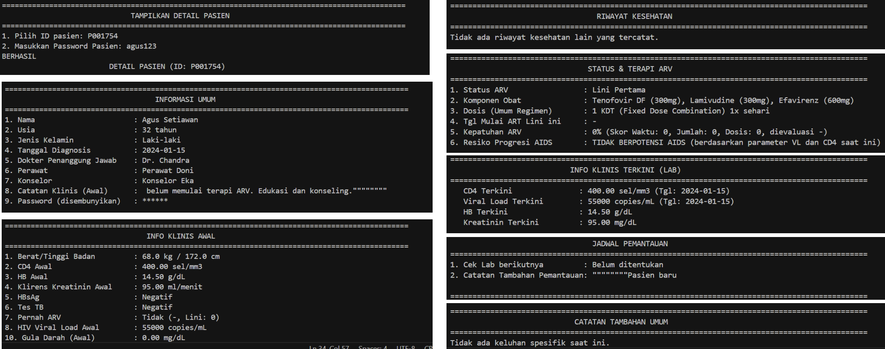
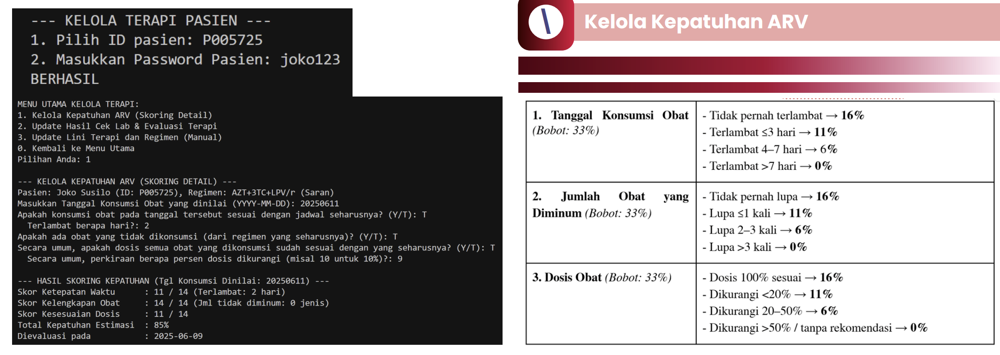
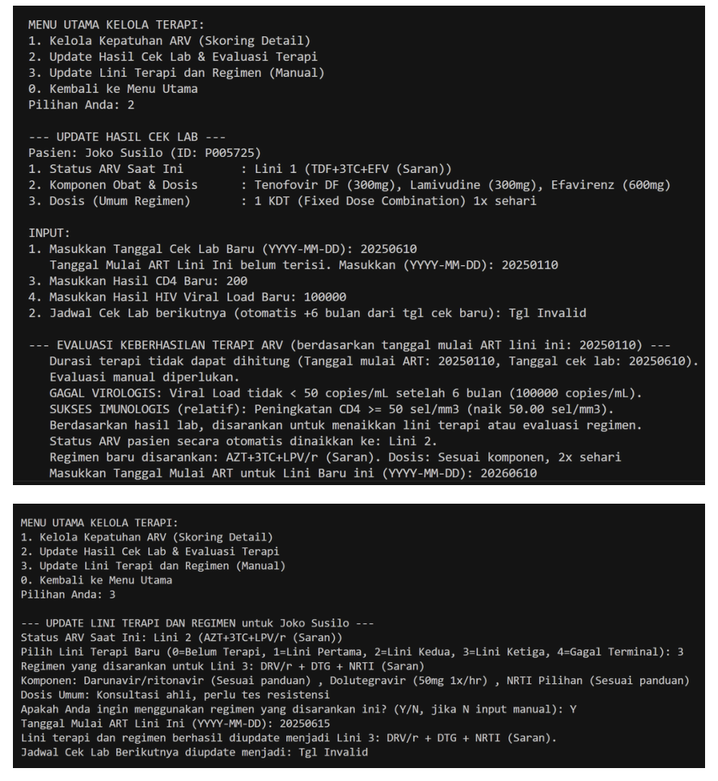
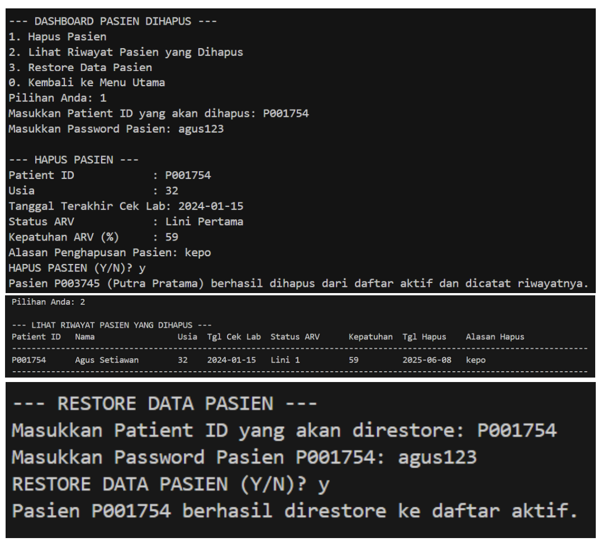

# HIVCare+: High-Performance Backend for HIV Treatment Monitoring

-00599C?logo=c&logoColor=white)


**HIVCare+** is a C-language backend system designed to manage patient records and monitor anti-retroviral therapy (ART) adherence efficiently. Built to eliminate database latency issues, it utilizes **low-level memory management (Structs/Pointers)** and **custom CSV parsing** to handle complex clinical logic for HIV/AIDS care.

## Key Features

### 1. Automated Clinical Decision Support
The system implements strict medical protocols based on National Guidelines to evaluate treatment success:
* **Virological Failure Detection:** Automatically flags patients if Viral Load > 1000 copies/mL after 6 months of therapy.
* **Auto-Regimen Switching:** Algorithms to suggest protocol changes (First Line $\rightarrow$ Second Line) upon detected failure.
* **AIDS Progression Alert:** Triggers critical warnings if CD4 count drops < 200 with high viral load, enabling early intervention.

### 2. Medication Adherence Algorithm
Calculates a precise adherence percentage based on a multi-vector scoring system:
* **Time Accuracy:** Adherence to specific consumption hours.
* **Dosage Accuracy:** Verification of prescribed dosage intake.
* **Consistency:** Tracking missed doses over a specific timeline.

### 3. Zero-Latency Data Management
* **Custom CSV Parser:** Implemented a manual CSV parser and writer in C to handle data persistence directly, removing the need for heavy SQL dependencies.
* **Memory Optimization:** Uses optimized data structures to map complex patient demographics, clinical history, and lab results into memory for instant retrieval.

## Application Interface

The system runs on a high-efficiency command line interface (CLI). Below are the snapshots of the core modules:

| **1. Main Menu Dashboard** | **2. Add New Patient** |
| :---: | :---: |
|  |  |
| *System entry point with ASCII art & navigation.* | *Input form for demographics & clinical baseline.* |

| **3. Patient Repository** | **4. Medical Record Detail** |
| :---: | :---: |
|  |  |
| *Summary view of all registered patients.* | *Comprehensive view of a single patient's history.* |

| **5. Therapy & Lab Evaluation** | **6. Audit Log (Deleted Data)** |
| :---: | :---: |
|  |  |
| *Logic evaluation for Viral Load & Adherence.* | *History of removed patients for data audit.* |

## Technical Architecture

### Directory Structure
The project follows a modular C engineering structure:
```text
HIVCare-Plus/
├── src/            # Source code (.c files) implementation
├── include/        # Header files (.h) definitions
├── data/           # CSV database storage
├── screenshots/    # Documentation images
└── Makefile        # Automated build script
